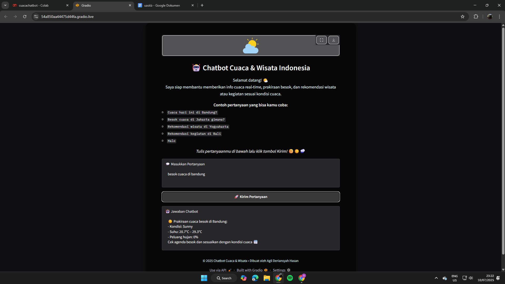
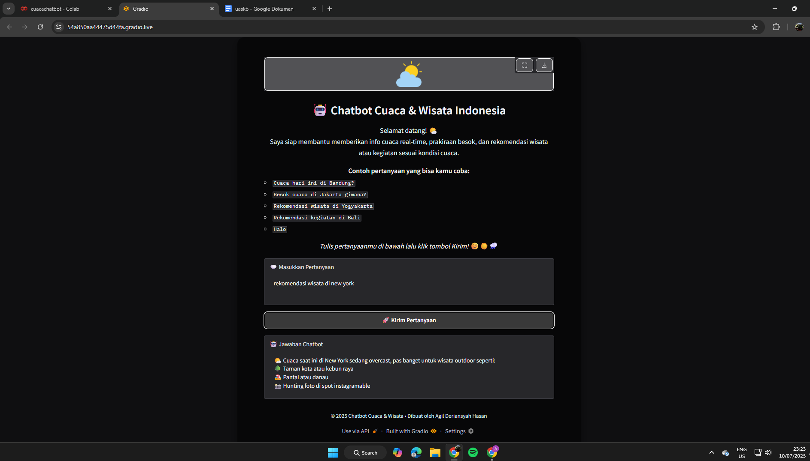
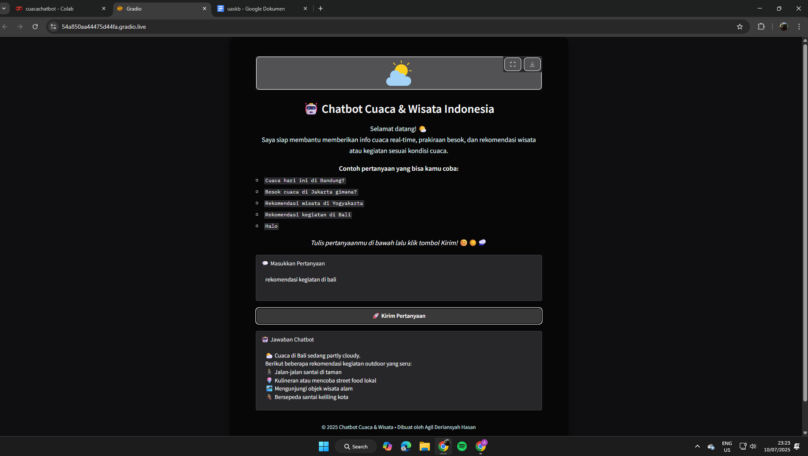

# 🌟 Chatbot Cuaca dan Rekomendasi Wisata Berbasis API WeatherAPI dan Gradio Interface 🌟

## 👥 Anggota Pembuat
| Nama                  | NPM        |
|-----------------------|------------|
| Agil Deriansyah Hasan | 4522210125 |

## 📚 Latar Belakang 
        Perkembangan teknologi AI dan API telah membuka peluang luas untuk menciptakan asisten virtual yang mampu membantu masyarakat dalam kehidupan sehari-hari. Salah satu kebutuhan yang sering dicari masyarakat adalah informasi cuaca real-time, prakiraan cuaca, dan rekomendasi tempat wisata atau kegiatan berdasarkan kondisi cuaca.

        Proyek ini bertujuan untuk membuat sebuah chatbot yang dapat memberikan jawaban otomatis atas pertanyaan pengguna terkait cuaca dan kegiatan wisata di kota-kota Indonesia menggunakan WeatherAPI dan diintegrasikan melalui Gradio untuk tampilan antarmuka web interaktif.

## 🎯 Tujuan 

- Menyediakan informasi cuaca hari ini dan prakiraan cuaca besok berdasarkan lokasi pengguna.
- Memberikan rekomendasi wisata dan kegiatan berdasarkan kondisi cuaca terkini.
- Membuat interface yang ramah pengguna dan bisa diakses melalui browser.
- Meningkatkan pengalaman interaktif melalui antarmuka Gradio.

## ⚙️ Teknologi yang DiGunakan
| Komponen|Deskripsi|
| ----------------------- | --------------------------------------------- |
| Python| Bahasa pemrograman utama|
| WeatherAPI| API pihak ketiga untuk mengambil data cuaca|
| Gradio| Library untuk membuat UI chatbot|
| Regular Expression (re) | Untuk menangani dan mengenali pola input teks |
| Requests| Untuk melakukan HTTP request ke API cuaca|

##  📦 Struktur Program 
### Kelas ChatbotCuaca
Kelas utama dalam proyek ini yang menangani:
- Inisialisasi URL dan API
- Pola regex untuk mengenali pesan pengguna

Fungsi-fungsi utama:
- ambil_cuaca_hari_ini(kota)
- ambil_cuaca_besok(kota)
- rekomendasi_wisata(kota)
- rekomendasi_kegiatan(kota)
- get_emoji(kondisi)
- respons_default() sebagai fallback

### Fungsi chatbot_response(pesan)
Fungsi ini menangani pesan dari pengguna, mencocokkan dengan pola regex, dan memanggil metode yang sesuai dari kelas ChatbotCuaca.

### 🖼️ Interface Gradio
Dengan gr.Blocks, UI dibuat dengan elemen-elemen berikut:
- Gambar logo chatbot
- Markdown penjelasan chatbot
- Textbox input pengguna
- Tombol kirim
- Textbox untuk jawaban bot
- Footer dengan nama pembuat

## 🔄 Alur Kerja ChatBot
- Pengguna memasukkan pesan (misal: "cuaca besok di Jakarta").
- Fungsi chatbot_response mencocokkan input dengan pola.
- Sistem mengenali maksud (intensi) dan kota (jika disebut).
- Chatbot memanggil API untuk mengambil data yang dibutuhkan.
- Data diolah dan dikirim kembali dalam bentuk teks responsif & ramah pengguna.
- Hasil ditampilkan di antarmuka Gradio. 

## 🌟 Fitur Utama 
| Fitur                | Penjelasan                                                                 |
| -------------------- | -------------------------------------------------------------------------- |
| Cuaca Hari Ini       | Menampilkan suhu, kondisi, kelembapan, dan saran praktis berdasarkan cuaca |
| Cuaca Besok          | Prakiraan cuaca, suhu, peluang hujan, dan tips aktivitas                   |
| Rekomendasi Wisata   | Saran wisata indoor/outdoor sesuai kondisi cuaca                           |
| Rekomendasi Kegiatan | Kegiatan seru yang bisa dilakukan tergantung kondisi cuaca                 |
| Respon Sapa & Sosial | Menanggapi sapaan seperti “halo” atau “terima kasih”                       |
| Interface Visual     | Antarmuka estetis dan interaktif dengan latar belakang tropis              |

## 📷 Hasil ChatBot 

## 🧾 Kesimpulan 
        Chatbot Cuaca & Rekomendasi Wisata Indonesia ini berhasil memberikan solusi interaktif berbasis web untuk membantu pengguna mendapatkan informasi cuaca secara real-time dan rekomendasi aktivitas berdasarkan kondisi cuaca. Dengan memanfaatkan API dari WeatherAPI serta antarmuka Gradio yang ramah pengguna, chatbot ini mampu merespon berbagai pertanyaan dengan cepat dan informatif. Fitur-fitur seperti prakiraan cuaca hari ini dan besok, rekomendasi wisata, hingga ide kegiatan menjadikan chatbot ini bermanfaat terutama bagi pengguna yang sedang merencanakan aktivitas harian atau perjalanan. Selain itu, desain yang ringan dan responsif membuat pengalaman pengguna menjadi lebih menyenangkan. Proyek ini dapat dikembangkan lebih lanjut dengan integrasi fitur geolokasi, suara, hingga peta wisata agar lebih cerdas dan kontekstual.