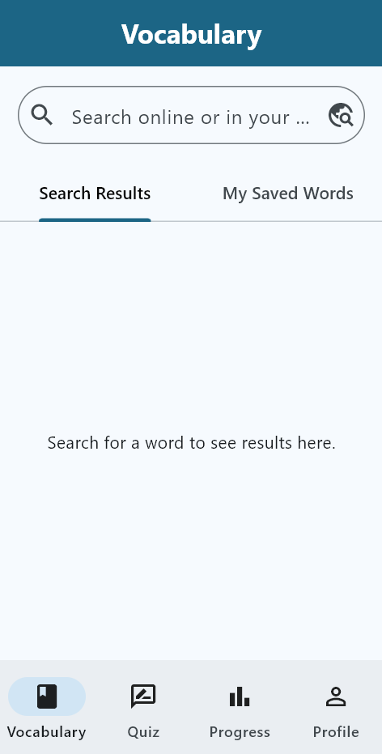
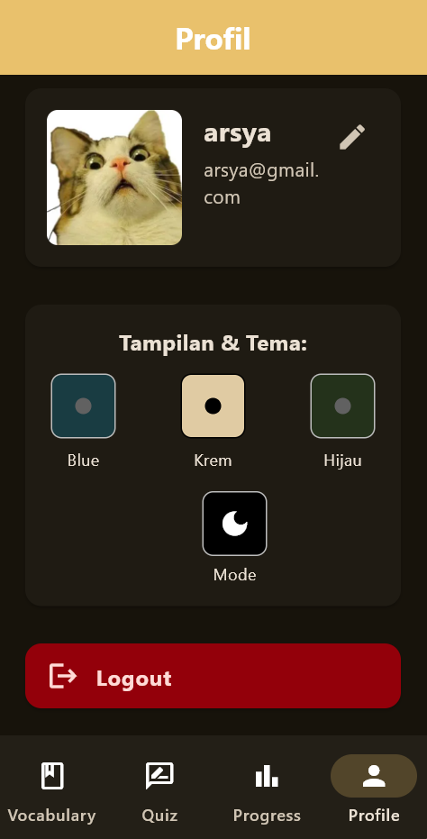

# 🌟 **Tugas Besar Pemrograman Berbasis Mobile – Kelompok 5** 🌟

## 🗳️ **Aplikasi Kosakata Inggris – *Wordly***


## 👥 **Anggota Kelompok**

| Nama                  | NPM        |
| --------------------- | ---------- |
| Arsya Yan Duribta     | 4522210117 |
| Agil Deriansyah Hasan | 4522210125 |

---

## 📲 Manual Penggunaan

Sebelum menggunakan aplikasi, Anda perlu memiliki akun.

### 🔐 Register (Mendaftar Akun Baru)

1. Buka halaman **Register**.
2. Isi kolom berikut:

   * **Name**: Masukkan nama Anda.
   * **Email**: Masukkan email yang valid.
   * **Password**: Buat kata sandi yang aman.
3. Klik tombol **Create Account**.
4. Jika sudah memiliki akun, klik tautan **Login**.

### 🔑 Login (Masuk ke Akun)

1. Buka halaman **Login**.
2. Masukkan email dan password Anda.
3. Klik tombol **Login**.
4. Jika belum memiliki akun, klik tautan **Register**.

---

## ✨ Fitur Utama

Setelah login, Anda dapat mengakses 4 menu utama melalui navigasi di bagian bawah aplikasi:

* **Vocabulary**
* **Quiz**
* **Progress**
* **Profile**

---

### 📚 Vocabulary (Kosakata)

Tempat menyimpan, mencari, dan mengelola kata-kata baru.

#### 🔎 Mencari Kata

* Gunakan bar pencarian di bagian atas.
* Ketik kata yang ingin dicari (contoh: *Efficiency*).
* Hasil pencarian menampilkan jenis kata, definisi, dan contoh kalimat.

#### ➕ Menyimpan Kata

* Klik ikon plus (+) pada hasil pencarian untuk menyimpan kata ke koleksi pribadi.

#### 📁 My Saved Words

* Tab ini berisi daftar kata yang telah Anda simpan.

#### ✏️ Mengelola Kata

* Klik kata dari daftar untuk melihat detailnya.
* Anda dapat:

  * **Edit**: Klik ikon pensil untuk mengubah deskripsi atau contoh kalimat, lalu klik *Save Changes*.
  * **Delete**: Klik ikon tempat sampah atau tombol *Delete* untuk menghapus kata dari daftar.

---

### 📝 Quiz (Kuis Kosakata)

Uji pengetahuan kosakata Anda.

#### Langkah-langkah:

1. Pilih level kuis yang tersedia (ditandai dengan centang hijau).
2. Klik tombol **Mulai Quiz**.
3. Baca definisi yang ditampilkan.
4. Ketik jawaban di kolom **Jawabanmu**, lalu klik **Kirim Jawaban**.
5. Setelah kuis selesai, halaman hasil akan menampilkan:

   * Ucapan selamat (contoh: *Sempurna!*).
   * Skor total Anda.
   * Informasi level dan kategori kuis.
   * Tombol **Ulangi Quiz** untuk mencoba lagi.

---

### 📊 Progress (Kemajuan Quiz)

Melacak riwayat kuis dan perkembangan belajar.

#### Fitur:

* Melihat daftar semua kuis yang telah Anda selesaikan, lengkap dengan:

  * Level
  * Skor
  * Tanggal pengerjaan
* Skor sempurna ditandai dengan ikon bintang (⭐).
* Klik item riwayat untuk melihat detail seperti:

  * Tanggal pengerjaan
  * Skor
  * Pertanyaan spesifik
  * Jawaban yang benar

---

### 👤 Profile (Profil)

Kelola akun dan preferensi tampilan.

#### 🔧 Mengedit Profil

* Klik ikon pensil di sebelah nama Anda.
* Anda dapat mengubah:

  * Nama
  * Email
  * Password (opsional)
  * Foto profil
* Klik **Simpan** untuk menyimpan perubahan atau **Batal** untuk membatalkan.

#### 🎨 Tampilan & Tema

* Pilih skema warna: **Blue**, **Krem**, atau **Hijau**.
* Beralih antara:

  * **Light Mode** (mode terang)
  * **Dark Mode** (mode gelap) dengan klik ikon matahari/bulan.

#### 🚪 Logout

* Klik tombol **Logout** untuk keluar dari akun.

---

## 💻 Versi Tablet/Desktop

Antarmuka aplikasi dioptimalkan untuk layar besar seperti tablet atau browser komputer.

### 🧭 Navigasi Sidebar

* Sidebar menggantikan bar navigasi bawah.
* Mode:

  * **Expanded**: Sidebar menampilkan ikon dan teks label.
  * **Collapsed**: Sidebar hanya menampilkan ikon.

Fungsi setiap menu tetap sama seperti di versi mobile.

### 🖥️ Tata Letak Layar Lebih Luas

* **Vocabulary**:

  * Tampilan master-detail.
  * Daftar kata di sisi kiri, detail kata muncul di sisi kanan, tanpa berpindah halaman.
* **Quiz**, **Progress**, dan **Profile**:

  * Konten ditampilkan lebih lega, memanfaatkan ruang layar besar.
  * Semua fitur tetap sama seperti versi mobile.

---

## 🌐 **Dokumentasi Aplikasi**

**Wordly** adalah aplikasi seluler yang dirancang untuk membantu pengguna mempelajari, mengelola, dan menguji kosakata bahasa Inggris mereka.
Fokus utama aplikasi ini adalah antarmuka yang intuitif, tema yang dapat disesuaikan, dan pengalaman belajar yang interaktif melalui kuis serta fitur pelacakan kemajuan.

---

## 🎯 **Tujuan Utama**

* Menyediakan sistem manajemen kosakata pribadi: menyimpan kata, definisi, dan contoh.
* Mempermudah belajar kosakata melalui kuis interaktif.
* Melacak performa pengguna dari waktu ke waktu.
* Menjamin data tetap tersimpan secara lokal meskipun aplikasi ditutup.

---

## 🛠 **Teknologi yang Digunakan**

| Teknologi                       | Fungsi / Deskripsi                                                           |
| ------------------------------- | ---------------------------------------------------------------------------- |
| Flutter                         | Framework utama untuk pengembangan aplikasi mobile dan web.                  |
| Sqflite                         | Database SQLite lokal untuk menyimpan data kosakata, user, dan riwayat kuis. |
| http                            | Untuk memanggil API eksternal (dictionaryapi.dev, random-word-api).          |
| cupertino\_icons                | Ikon bergaya iOS untuk antarmuka.                                            |
| flutter\_adaptive\_scaffold     | Scaffold responsif agar UI adaptif di mobile, tablet, dan desktop.           |
| path                            | Mengelola path file di penyimpanan lokal.                                    |
| sqflite\_common\_ffi & ffi\_web | Dukungan SQLite di desktop dan web.                                          |
| image\_picker                   | Memilih foto profil dari galeri atau kamera.                                 |
| confetti                        | Efek konfeti saat pengguna mendapat skor sempurna di kuis.                   |
| flip\_card                      | Widget kartu balik interaktif untuk kosakata.                                |

---

## 🚀 **Fitur Utama**

### 🔑 Otentikasi

* Login dan registrasi akun.
* Manajemen sesi login menggunakan state di MyApp.

---

### 📚 Manajemen Kosakata

* Cari definisi kata secara daring.
* Simpan kata beserta definisi dan contoh.
* Lihat daftar kata tersimpan.
* Edit atau hapus kata yang sudah disimpan.
* Tampilkan kata sebagai *flip card* (kartu depan–belakang).
* Semua data disimpan di database lokal SQLite.

---

### 🧪 Kuis Interaktif

* Buat kuis dari kata acak melalui API.
* Pilih tingkat kesulitan atau kategori kata.
* Menjawab kuis berbasis definisi.
* Hitung dan tampilkan skor.
* Simpan hasil kuis sebagai riwayat.
* Efek konfeti untuk hasil sempurna.

---

### 📊 Pelacakan Kemajuan

* Lihat riwayat kuis lengkap.
* Klik riwayat untuk melihat detail: skor, tanggal, level, jenis kata, dan soal.
* Tampilan responsif berbasis grid.

---

### 👤 Profil & Pengaturan

* Lihat dan edit profil (nama, email, kata sandi, foto).
* Ganti foto profil dari galeri.
* Ganti tema warna (Biru, Krem, Hijau Hutan).
* Mode gelap / terang.
* Logout akun.

---

## 🗄️ **Model Data**

| *Model*           | *Atribut*                                                                                                                        |
| --------------- | ------------------------------------------------------------------------------------------------------------------------------ |
| **User**        | userId (PK), name, email, password, imagePath (nullable)                                                                       |
| **Word**        | id (PK), userId (FK), name, description, example                                                                               |
| **QuizWord**    | word, definition, partOfSpeech                                                                                                 |
| **QuizHistory** | id (PK), userId (FK), score, totalQuestions, level, partOfSpeech, date, questions (*disimpan sebagai JSON string di database*) |

---

## 💾 **Struktur Database**

* Database SQLite lokal (Sqflite).
* Tabel:

  * users → data user.
  * words → kata-kata tersimpan.
  * quiz_histories → hasil riwayat kuis.
* Kolom questions pada quiz_histories disimpan sebagai JSON string.
* Pengelolaan database dibantu oleh:

  * DatabaseHelper.instance → untuk data user & kata.
  * DatabaseHelperQuiz → untuk data riwayat kuis.

---

## ✨ **Ringkasan**

Aplikasi **Wordly** diharapkan dapat menjadi teman belajar kosakata yang interaktif, rapi, dan mudah digunakan, membantu pengguna memperkaya kosakata serta memantau progres belajarnya dengan cara yang menyenangkan.

---


## 📸 **Screenshots — Aplikasi *Wordly* Vocabulary App**

Cuplikan layar fitur utama aplikasi Wordly untuk perangkat Mobile dan Tablet/Desktop:

---

## **Mobile Version**

| **Fitur & Deskripsi**                                                       |               **Cuplikan Layar**              |
| :-------------------------------------------------------------------------- | :-------------------------------------------: |
| **Register Page**<br>Halaman pendaftaran akun baru.                         |           |
| **Login Page**<br>Form login untuk mengakses akun.                          |                 |
| **Vocabulary - Search & Save**<br>Cari kosakata baru dan simpan ke koleksi. |         <br>       |
| **My Saved Words**<br>Daftar kata yang telah Anda simpan.                   |   <br>   |
| **Edit & Manage Words**<br>Ubah atau hapus kata dari daftar koleksi.        |          |
| **Quiz - Select Level**<br>Pilih level kuis untuk mulai uji kemampuan.      |    |
| **Quiz In Progress**<br>Menjawab pertanyaan berdasarkan definisi kata.      |  |
| **Quiz Results**<br>Melihat hasil kuis dan skor Anda.                       |    |
| **Progress Tracker**<br>Melacak riwayat kuis dan perkembangan belajar.      |      <br>     |
| **Profile Page**<br>Kelola akun dan preferensi tampilan.                    |       <br>      |
| **Theme & Dark Mode**<br>Pilih tema warna dan aktifkan dark mode.           |    <br><br><br>    |

---

## **Tablet/Desktop Version**

| **Fitur & Deskripsi**                                                                   |                 **Cuplikan Layar**                |
| :-------------------------------------------------------------------------------------- | :-----------------------------------------------: |
| **Sidebar Navigation**<br>Sidebar dapat diperluas atau diciutkan.                       |         <br>        |
| **Vocabulary Master-Detail View**<br>Tampilan daftar kata & detail bersamaan.           |   <br>   |
| **Enhanced Quiz & Progress Layout**<br>Layout lebih lega & rapi untuk kuis dan progres. | <br> |
| **Profile Settings on Wide Screen**<br>Kelola akun di tampilan layar besar.             |    <br>    |

---
Tentu! Berikut adalah contoh template **README** untuk menampilkan **video YouTube** di dokumentasi proyek Anda, lengkap dengan format profesional dan bersih:

---

## 🎥 **Demo Video — *Wordly* Vocabulary App**

🔗 **Tonton di YouTube** <br>
[


Klik gambar di atas atau kunjungi tautan berikut untuk menonton langsung di YouTube:
👉 [https://www.youtube.com/watch?v=`VIDEO_ID`](https://youtu.be/LY9Bpb-Ydrg)

---
## 🚀 Cara Menjalankan Aplikasi

Berikut adalah panduan untuk menginstal dan menjalankan proyek ini.

### Langkah-langkah Instalasi

1.  **Clone atau Siapkan Proyek:**
    Jika ini adalah sebuah repository Git, clone proyeknya.
    ```bash
    git clone [link-repo.git]
    cd nama-repo-anda
    ```
    Jika Anda memiliki file secara lokal, buat proyek Flutter baru dan lanjutkan ke langkah berikutnya.

2.  **Dapatkan Dependencies:**
    Jalankan perintah ini di terminal dari direktori utama proyek Anda untuk mengunduh semua package yang dibutuhkan.
    ```bash
    flutter pub get
    ```

3.  **Jalankan Aplikasi:**
    Pastikan emulator atau perangkat Anda sudah siap, lalu jalankan perintah berikut:
    ```bash
    flutter run
    ```

---
