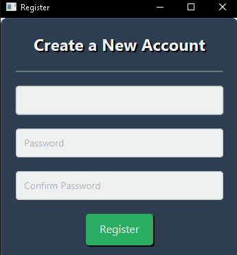
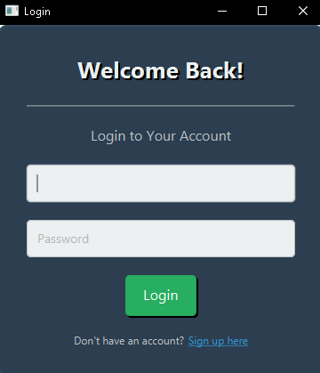

# 🌟 **Tugas Besar Pemrograman Berorientasi Objek** 🌟

## 🏥 **Aplikasi Sistem Informasi Rumah Sakit**

### 👥 **Anggota Kelompok**
| Nama                   | NPM         |
|------------------------|-------------|
| Agil Deriansyah Hasan | 4522210125  |

---

### 🌐 **Deskripsi Aplikasi**
Aplikasi ini dirancang untuk mempermudah pengelolaan layanan rumah sakit, seperti:
- Manajemen pasien
- Reservasi kamar
- Pemesanan obat
- Pembuatan laporan operasional

Dengan menggunakan **JavaFX** sebagai framework utama, aplikasi ini menawarkan antarmuka modern, responsif, dan user-friendly. Pendekatan **Model-View-Controller (MVC)** diterapkan untuk memastikan pengembangan yang terstruktur, mencakup desain antarmuka menggunakan FXML hingga sistem manajemen data yang terintegrasi.

---

### 🛠️ **Teknologi yang Digunakan**
| Teknologi               | Deskripsi                                                                 |
|-------------------------|---------------------------------------------------------------------------|
| **Java**               | Bahasa pemrograman utama untuk membangun aplikasi.                      |
| **JavaFX**             | Framework untuk pengembangan antarmuka pengguna yang modern dan intuitif.|
| **FXML**               | Format berbasis XML untuk mendesain antarmuka pengguna.                 |
| **MVC**                | Arsitektur untuk memisahkan logika aplikasi, antarmuka, dan data.       |
| **IntelliJ IDEA**      | IDE untuk pengembangan dan debugging aplikasi Java.                     |

---

### 🚀 **Fitur-Fitur Utama**

- **Landing Page**
  - Sambutan ramah dengan tombol login/daftar yang mudah diakses.
  - Menampilkan informasi fitur utama aplikasi secara singkat.

- **Dashboard**
  - Statistik harian, seperti jumlah pasien, ketersediaan kamar, dan pemesanan obat.
  - Notifikasi real-time untuk aktivitas penting.

- **Manajemen Pasien**
  - Tambah, edit, hapus data pasien dengan antarmuka sederhana.
  - Fitur pencarian cepat berdasarkan nama, ID, atau tanggal kunjungan.
  - Riwayat medis pasien tersimpan untuk pengelolaan data jangka panjang.

- **Reservasi Kamar**
  - Memeriksa ketersediaan kamar secara real-time.
  - Pengelompokan kamar berdasarkan kategori (VIP, standar, ICU, dll.).
  - Pengingat otomatis untuk reservasi yang akan segera habis masa berlakunya.

- **Pemesanan Obat**
  - Mengelola pemesanan dan stok obat secara lengkap.
  - Notifikasi untuk stok obat yang mendekati habis.

- **Laporan**
  - Membuat, melihat, dan mengunduh laporan statistik (PDF, Excel, dll.).
  - Grafik dan visualisasi data untuk wawasan lebih mendalam.

---

### 📸 **Hasil Screenshot**
| Halaman             | Screenshot                              |
|---------------------|-----------------------------------------|
| **Home Page**       |          |
| **Register**        |            |
| **Login**           |                  |
| **Dashboard**       |          |
| **Manajemen Pasien**|      |
| **Reservasi Kamar** |  |
| **Pemesanan Obat**  |          |
| **Laporan**         |              |

---

### 💬 **Feedback**
Kami sangat menghargai setiap masukan! Jika ada saran atau bug yang ditemukan, silakan buat *issue* di repository ini atau hubungi kami melalui [email](mailto:agil@example.com).

---

## 👨‍💻 **Kontribusi**

  <b>Agil Deriansyah Hasan</b> 
  <i>4522210125</i>

---

### 📜 **Lisensi**
Proyek ini dilisensikan di bawah [MIT License](LICENSE).

---

   

