# 🌟 Website Proyek Bisnis Makanan   
## 🛒 Prototipe Website Toko Online “MacRAM”

---

## 👥 Anggota Kelompok

| Nama                              | NPM         |
|-----------------------------------|-------------|
| Agil Deriansyah Hasan            | 4522210125  |

---
## 📌 Latar Belakang

Industri makanan ringan di Indonesia berkembang pesat, khususnya produk dengan rasa unik seperti makaroni pedas. Sayangnya, banyak pelaku UMKM belum memanfaatkan platform digital secara optimal. Proyek ini bertujuan membuat **prototipe toko online makaroni pedas** yang **modern, praktis, dan menarik** bagi generasi muda.

---

## 🎯 Tujuan Proyek

- Menentukan jenis produk yang dijual secara online.
- Menganalisis target pasar secara spesifik.
- Mengidentifikasi kompetitor dan keunikan produk sebagai pembeda.

---

## 📦 Identifikasi Produk

- **Brand:** MacRAM  
- **Produk:** Snack makaroni goreng renyah  
- **Varian Rasa:**  
  - Original  
  - Balado  
  - Keju  
  - BBQ  
  - Pedas (Level 1–5)  
- **Harga:**  
  - Kecil: Rp 8.000  
  - Besar: Rp 20.000  

---

## 🎯 Analisis Target Pasar

### 👤 Segmentasi Demografis
- **Usia:** 15–30 tahun  
- **Jenis Kelamin:** Laki-laki & Perempuan  
- **Pekerjaan:** Pelajar, Mahasiswa, dan Pekerja Muda  

### 💡 Perilaku Konsumen
- Menyukai desain produk yang unik & promo menarik  
- Lebih memilih transaksi via WhatsApp atau e-commerce  
- Mudah terpengaruh tren makanan viral di TikTok, Instagram, dan YouTube  

---

## 📊 Analisis Pesaing

| Brand          | Keunggulan                                      | Kekurangan                           |
|----------------|--------------------------------------------------|--------------------------------------|
| Makaroni Ngehe | Terkenal, banyak cabang                         | Visual kurang kekinian               |
| Bonju Snack    | Harga murah, jaringan reseller luas             | Kualitas kemasan kurang konsisten    |
| **MacRAM**     | Branding modern, pemasaran fleksibel            | Masih dalam tahap awal pengembangan  |

### ⭐ Keunggulan MacRAM
- Visual branding modern & konsisten  
- Rasa dan tingkat pedas dapat dipersonalisasi  
- Strategi pemasaran melalui WhatsApp & Instagram  
- Promosi visual yang menarik & kekinian

---

## 🧱 Pengembangan Prototipe

Website dirancang **responsif**, **user-friendly**, dan menarik untuk generasi digital native.

### ⚙️ Teknologi Digunakan
- **Front-End:** HTML, CSS, JavaScript  
- **Back-End:** PHP (XAMPP)  
- **Database:** MySQL  
- **Framework (opsional):** Bootstrap

### 🔧 Fitur Utama
- **🔍 Pencarian Produk:** berdasarkan nama, rasa, level pedas  
- **🛒 Keranjang Belanja:** tambah, hapus, jumlah & total harga  
- **💳 Checkout:** input data, metode pembayaran, & konfirmasi  
- **📲 WhatsApp Order:** kirim detail pesanan langsung via WA  

---

## 🧰 Wireframe & Mockup

### 🎨 [Lihat Wireframe di Figma](https://www.figma.com/design/BfiB5V6zrtmO2H2tWb1vYL/Untitled?node-id=0-1&t=bweSBqv0hdveP3MD-1)

### 📷 Mockup Tampilan

| Mockup | Preview |
|--------|---------|
| Tampilan 1 | 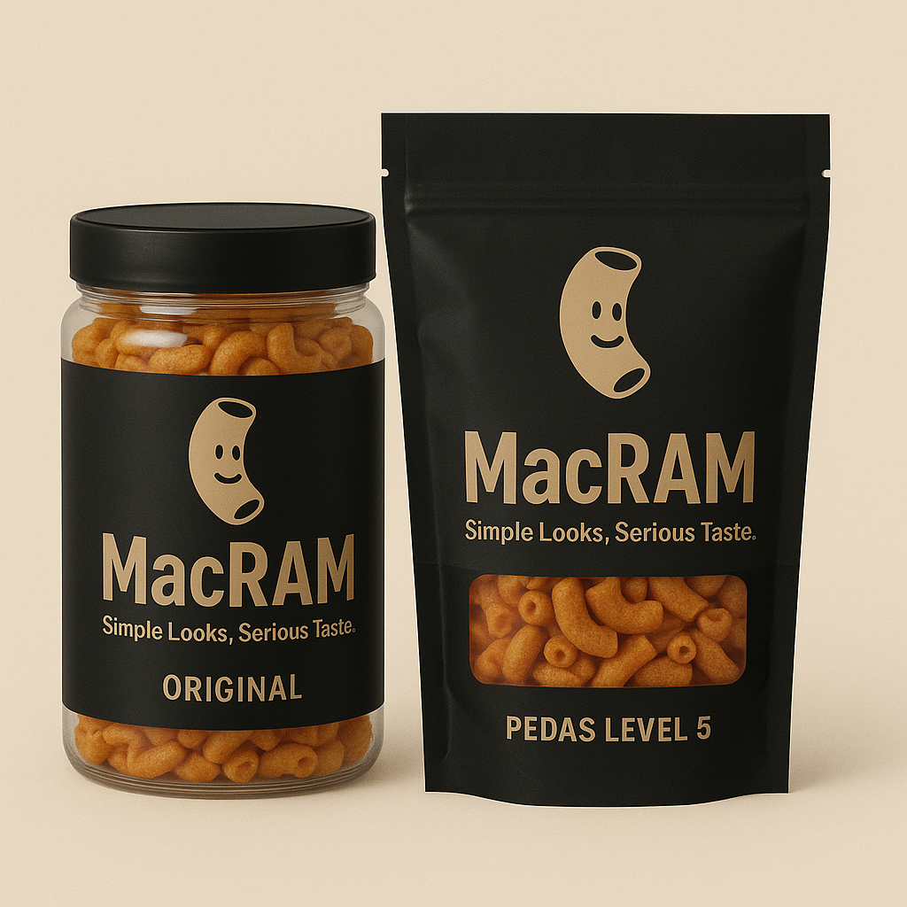 |
| Tampilan 2 | 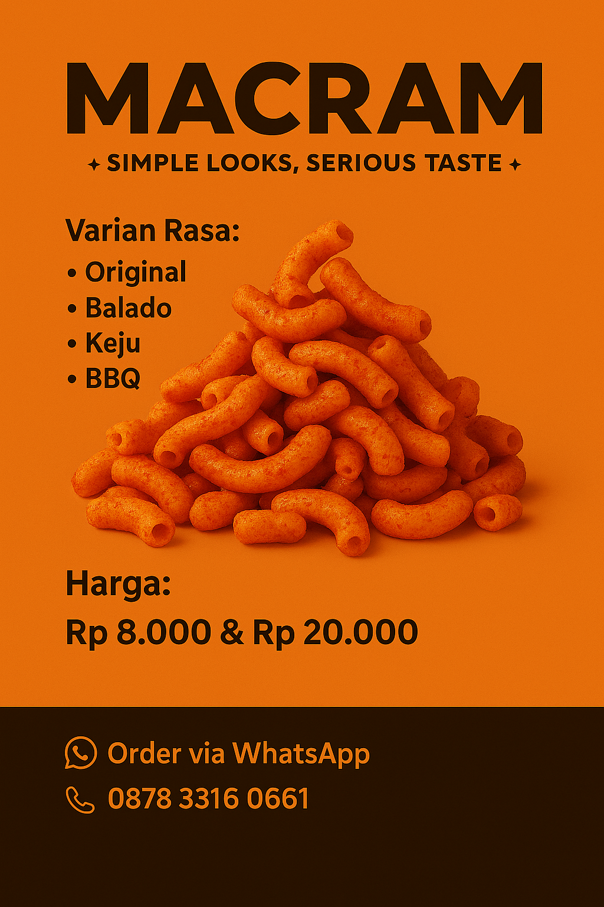 |
| Tampilan 3 | 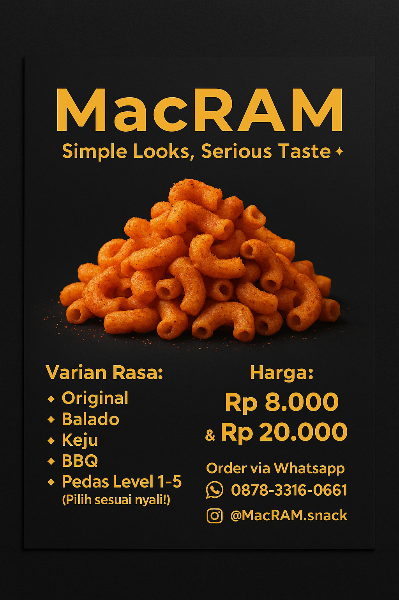 |
| Tampilan 4 | 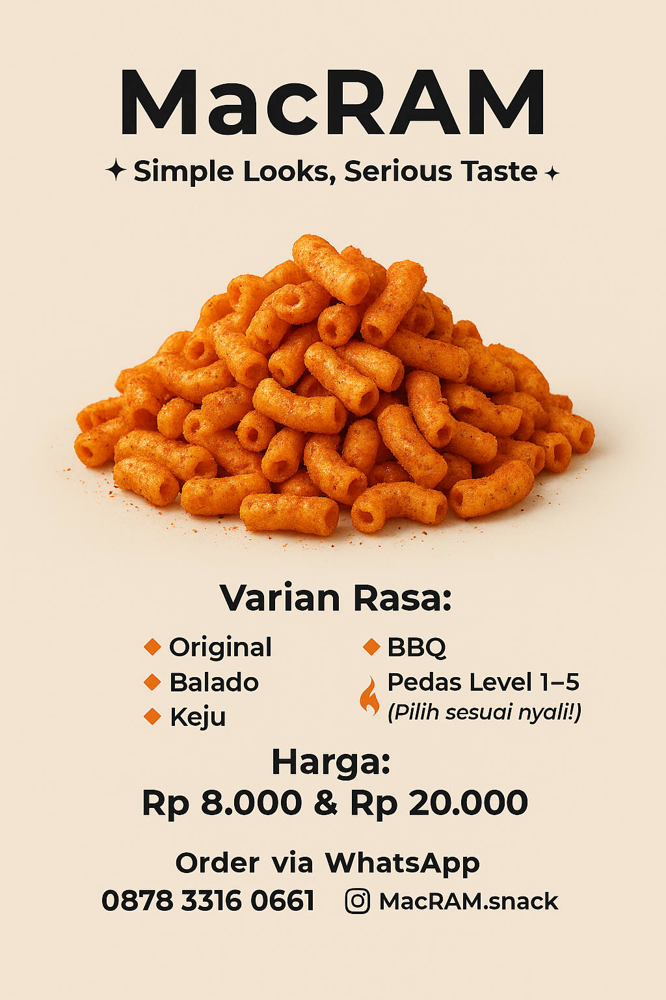 |

---

## 🖼️ Tampilan Halaman Website

| Halaman         | Gambar                        |
|------------------|-------------------------------|
| Home             | 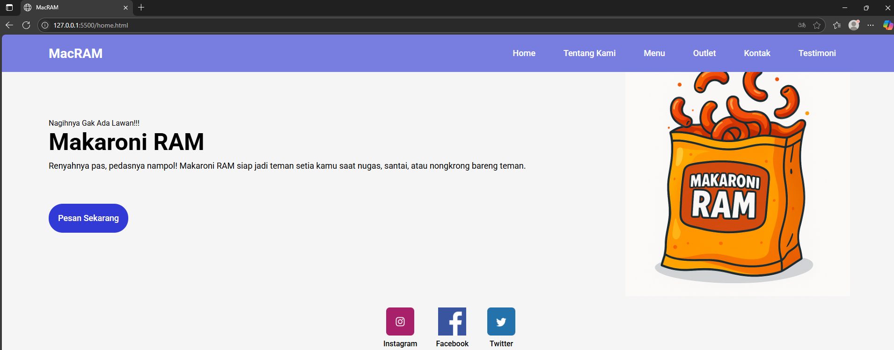       |
| Tentang Kami     | 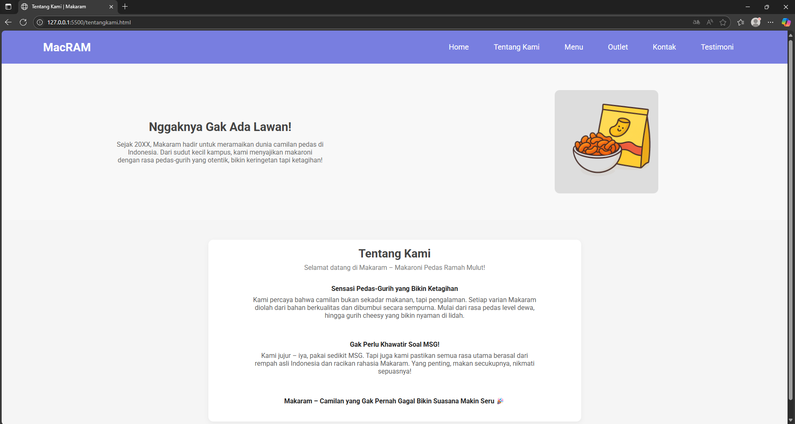    |
| Menu Produk      | 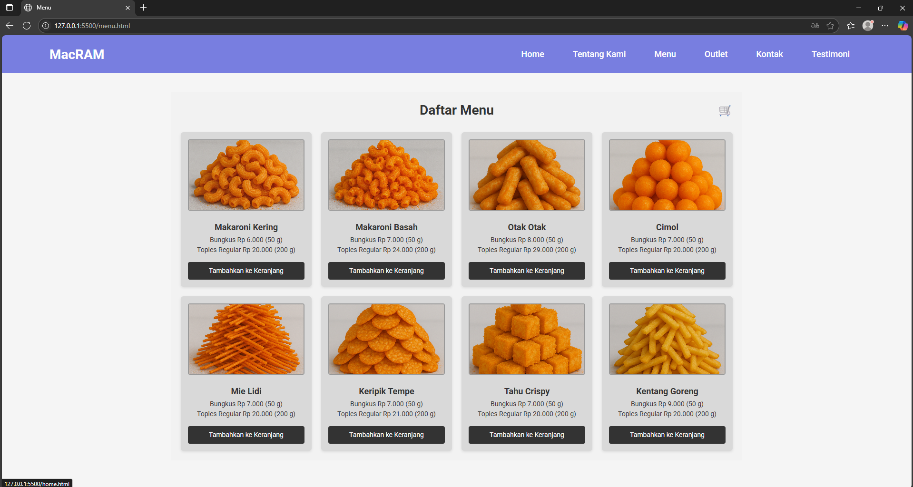       |
| Detail Pemesanan | 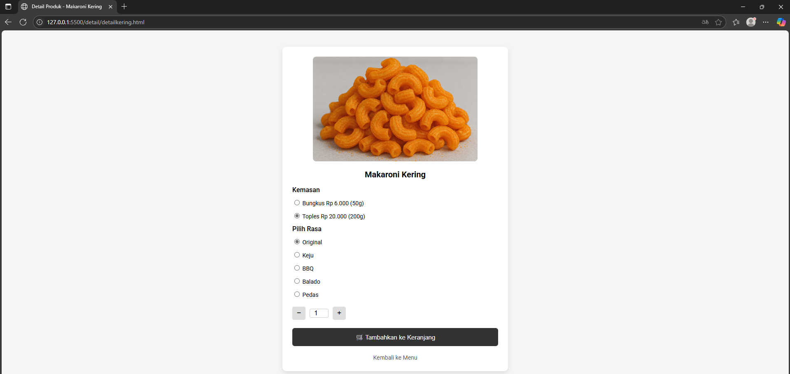     |
| Keranjang        | 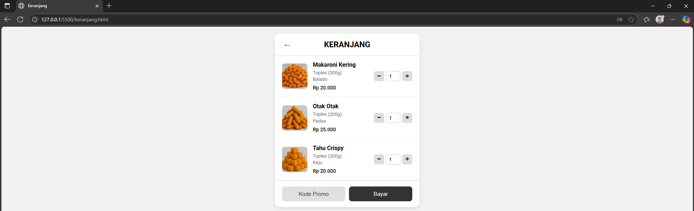  |
| Pembayaran       | 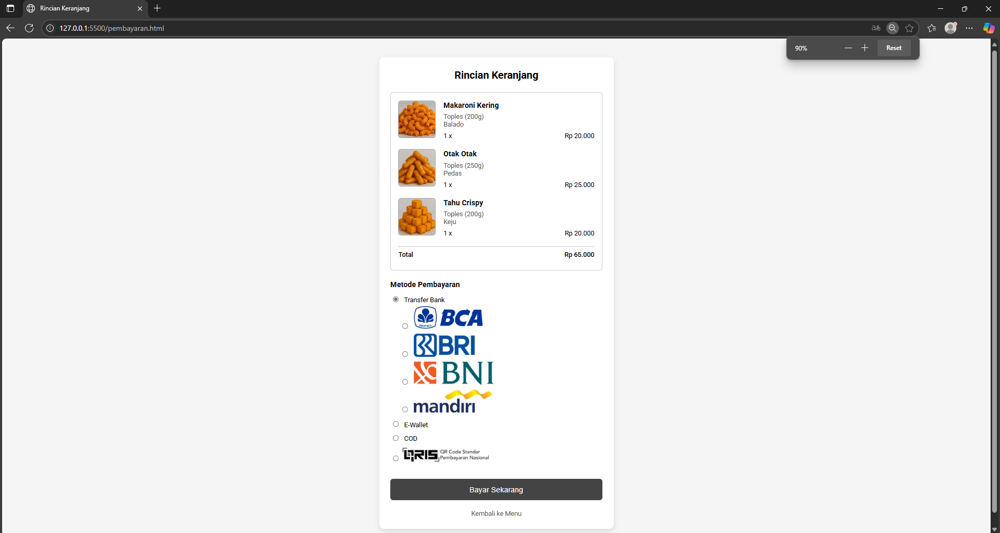 |
| Outlet           | 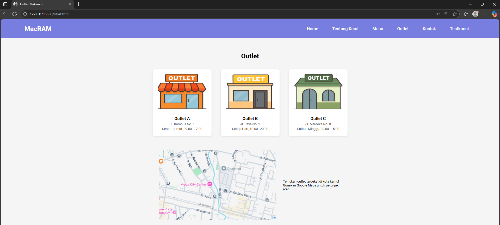     |
| Kontak Kami      | 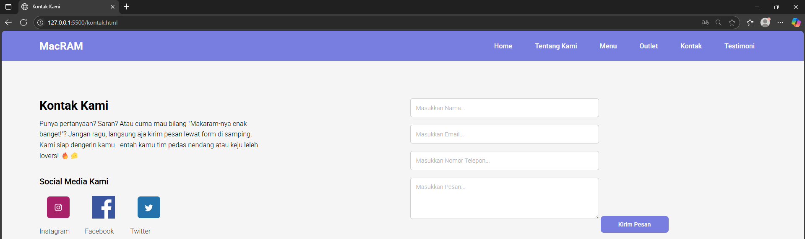     |
| Testimoni        | 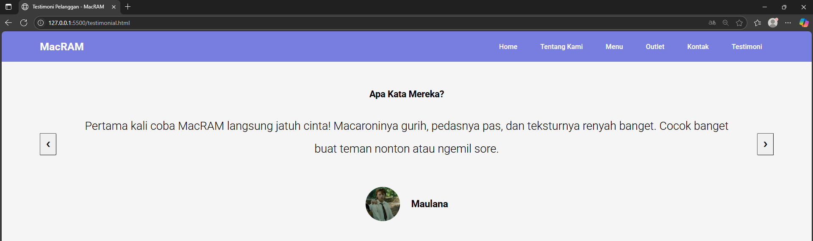  |

---

## ✅ Kesimpulan

Proyek ini membuktikan bahwa produk lokal seperti makaroni pedas bisa ditingkatkan nilai jualnya melalui digitalisasi. Dengan branding yang tepat dan strategi pemasaran yang cerdas, **MacRAM** berpotensi menjadi snack kekinian favorit generasi muda yang **viral** dan **mudah diakses secara online**.

---

> Made with ❤️ by Kelompok 11 – Proyek E-Business
