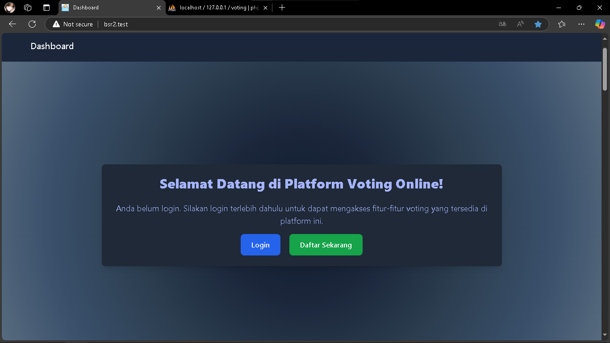

# 🌟 **Tugas Besar Pemrograman Berbasis Web - Kelompok 13** 🌟  
## 🗳️ **Aplikasi Sistem Voting Online**  

### 👥 **Anggota Kelompok**  
| Nama | NPM |
| ---- | --- |
| Agil Deriansyah Hasan | 4522210125 |

---

### 🌐 **Deskripsi Aplikasi Web**

Aplikasi ini merupakan platform pemungutan suara berbasis web yang dirancang untuk mempermudah proses voting secara online. Dengan mengutamakan keamanan, akurasi data, dan kemudahan penggunaan, aplikasi ini cocok untuk berbagai kebutuhan, seperti pemilu organisasi, pemilihan ketua, atau polling umum lainnya.

### 🎯 **Tujuan Utama**
- Efisiensi: Mengganti proses voting manual dengan sistem digital yang lebih cepat dan terorganisir.
- Keamanan: Menjamin data pemilih dan hasil suara terlindungi dari manipulasi.
- Kemudahan: Memberikan pengalaman yang sederhana dan intuitif untuk pengguna.

---

### 🛠️ Teknologi yang Digunakan  
| Teknologi     | Deskripsi                                 |  
|---------------|-------------------------------------------|  
| Laravel       | Framework PHP untuk membangun aplikasi web |  
| MySQL         | Database relasional untuk menyimpan data  |  
| Blade         | Template engine bawaan Laravel            |  
| Chart.js      | Library untuk visualisasi data            |  

---

### 🚀 **Fitur-Fitur**  

#### 🔑 **Fitur untuk Admin**  
Admin memiliki akses ke semua fitur user biasa, ditambah fitur eksklusif:  

- **🏠 Dashboard**  
  Mengakses tampilan utama aplikasi.  

- **🗳️ Voting**  
  Melihat atau berpartisipasi dalam pemungutan suara.  

- **📊 Result**  
  Mengakses hasil pemungutan suara.  

- **👤 Candidate**  
  Melihat, menambah, mengedit, atau menghapus data kandidat.  

- **🔒 Admin Area**  
  - Melihat daftar voting & masukan dari pemilih.  
  - Melihat hasil voting dan statistik pemilih.  

#### 👤 **Fitur untuk User**  

- **🏠 Dashboard**  
  Mengakses tampilan utama aplikasi.  

- **🗳️ Voting**  
  Berpartisipasi dalam pemungutan suara.  

- **📊 Result**  
  Melihat hasil pemungutan suara.  

- **👤 Candidate**  
  Melihat detail kandidat yang berpartisipasi.  

- **🛠️ Profil**  
  Mengedit profil pengguna. 

---

### 📐 **Entity-Relationship Diagram (ERD)**  

---

### 🎭 **Use Case Diagram**  

---

### 🛢️ **ERD di Dalam Database MySQL**  

---

### 📸 **Hasil Screenshot**  

#### **🏠 Halaman Dashboard**  
- Jika Belum Login

- Sesudah Login

#### **🗳️ Halaman Voting**  

#### **📊 Halaman Result**  

#### **👤 Halaman Candidate**  

- Halaman Untuk User Bagian Halaman Candidate

- Halaman Untuk Admin Bagian Halaman Candidate

**Create**

**Read & Delete**

**Update**

#### **🔒 Halaman Admin Area**  

#### **🔑 Auth**  

#### **📋 Header & Footer**  

---

### 💬 Feedback  
Kami sangat menghargai setiap masukan! Jika ada saran atau bug yang ditemukan, silakan buat issue di repository ini atau hubungi kami melalui [email](mailto:agil@example.com).  

---

## 👨‍💻Kontribusi

  <b>Agil Deriansyah Hasan</b> 
  <i>4522210125</i>

---

### 📜 **Lisensi**  
Proyek ini dilisensikan di bawah [MIT License](LICENSE).

        

---
